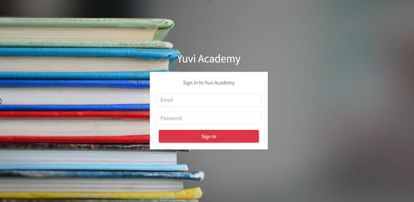
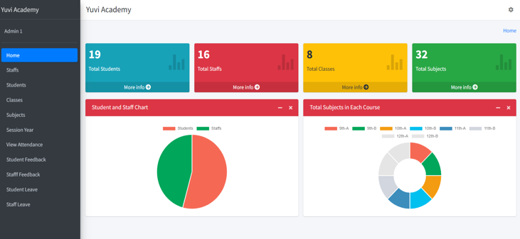
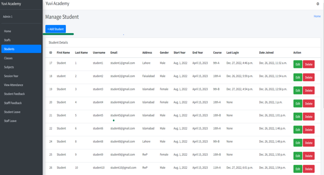
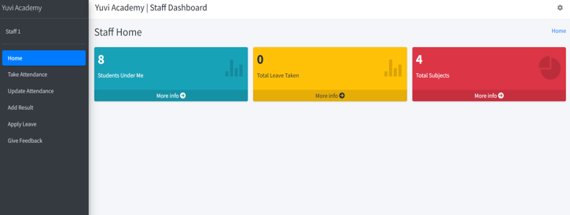
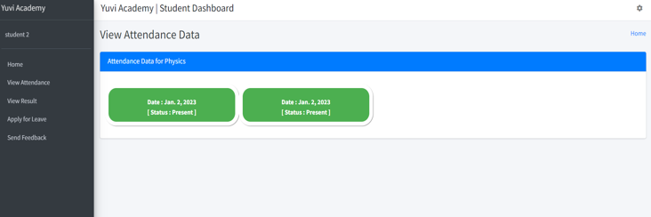
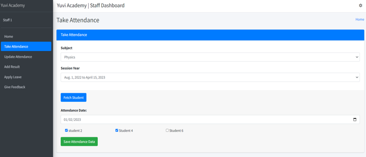

# Yuvi Academy DBMS Project
I develop this end semester project of Database Management Systems course with my team member [Yuvraj Sagar](https://github.com/YuvrajSagar5182). we develop it with Django python framework and MySQL databse.

This is a web-based academy management system developed to streamline and automate administrative tasks in an academy. It aims to improve efficiency and productivity for academy staff while providing a user-friendly interface for students to access their academic records and course materials.

## Scope

The academy management system covers the following functionalities:

- Student enrollment
- Course scheduling
- Grading and assessment
- Student records
- Feedback management
- Communication between students, teachers, and staff
- Attendance management
- Leave application

The system is designed for a medium-sized academy with diverse student body and academic programs. It is developed using web technologies and can be accessed through a web browser.

## Objectives

The main objectives of this project are:

- Improve the efficiency and effectiveness of academy management processes
- Provide a user-friendly interface for students to access their academic records and course materials
- Enhance communication and collaboration among students, teachers, and staff
- Reduce reliance on paper-based systems and manual processes
- Increase data security and privacy

## Purpose

The web-based academy management system serves as the central hub for all academy-related activities, providing a single source of truth for student and course information. It enables academy staff to manage and track student progress and facilitates communication and collaboration between students and teachers. By streamlining and automating administrative tasks, the system frees up time and resources for more important activities, such as teaching and learning. The ultimate goal of the project is to improve the quality of education and the overall student experience at the academy.

## Expected Users

The system caters to three main users:

1. Admin: Responsible for overseeing and managing the academy's activities.
2. Staff: Includes teachers and other academy staff involved in teaching and administrative tasks.
3. Students: Enrolled students who use the system to access their academic information.

## Functional Requirements

### Admin:

- View and manage academic activities, including graphs and visualizations.
- Manage student information, including enrollment status, contact details, and academic records.
- Manage staff information, including adding and deleting staff members.
- Manage classes, subjects, and session years.
- View and analyze attendance records.
- Handle student and staff feedback.
- Oversee and manage student and staff leaves.

### Staff:

- Check the list of students under their care for specific subjects.
- Update attendance records for the students under their care.
- Enter and update academic results for the students.
- Apply for leave.
- Provide feedback on various aspects of the academy.

### Students:

- View the list of subjects they are enrolled in.
- Access their attendance records.
- View their academic results.
- Apply for leave.
- Provide feedback on various aspects of the academy.

## Non-Functional Requirements

### Security Requirements:

- Ensure data security and confidentiality through secure login protocols, data encryption, and access controls. Sensitive information, like login passwords, is encrypted using SHA-256 Hash Algorithm.

### User-Friendly Interface:

- Design a user-friendly interface for easy navigation and usability, improving user satisfaction and productivity.

### System Requirements:

- The system is developed for Windows and currently executed on localhost:8000. It requires a server, operating system, and database to function correctly.

#Installation of Django App with MySQL Database

## Prerequisites

Make sure you have the following software installed on your system:

- Python (version 3.7 or higher)
- Django (version 3.2 or higher)
- MySQL (version 5.7 or higher)

## Installation

1. Clone the repository to your local machine:

   ```bash
   git clone https://github.com/SHnice/DBMS-Yuvi-Academy-Project
   ```

2. Create and activate a virtual environment (optional, but recommended):

   ```bash
   python3 -m venv myenv
   source myenv/bin/activate
   ```

3. Install the required Python packages:

   ```bash
   pip install -r requirements.txt
   ```

4. Create a MySQL database for your application.

5. Update the database settings in the `settings.py` file located in the project's directory (`myapp/settings.py`). Modify the following lines with your database details:

   ```python
   DATABASES = {
       'default': {
           'ENGINE': 'django.db.backends.mysql',
           'NAME': 'your_database_name',
           'USER': 'your_database_user',
           'PASSWORD': 'your_database_password',
           'HOST': 'localhost',
           'PORT': '3306',
       }
   }
   ```

6. Apply the database migrations:

   ```bash
   python manage.py migrate
   ```

7. Create a superuser for the Django admin (optional):

   ```bash
   python manage.py createsuperuser
   ```

## Running the Application

To start the Django development server, run the following command:

```bash
python manage.py runserver
```

You should see output similar to the following:

```
Starting development server at http://127.0.0.1:8000/
Quit the server with CONTROL-C.
```

Open your web browser and visit `http://127.0.0.1:8000/` to access your Django web application.


That's it! You should now have your Django web application up and running with a MySQL database. Feel free to customize and build upon this template to fit your specific project requirements.


## Screeshots
### First Page:

### Admin Page:

### Management Page:

### Staff Page:

### Attendance Page:

### Add Stuff Page:


